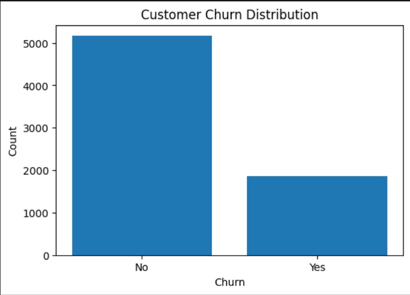
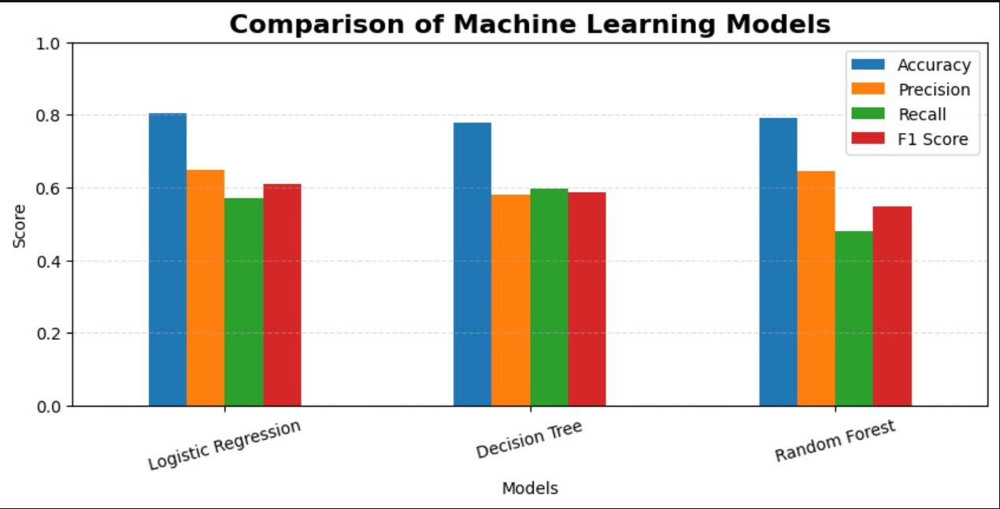
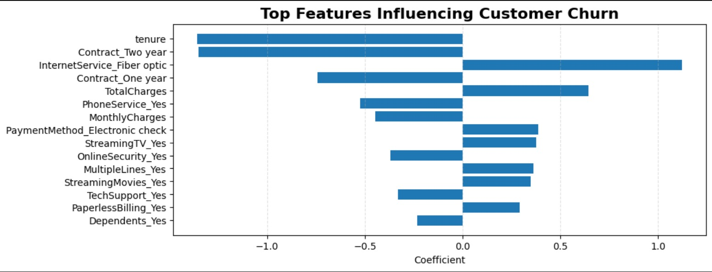
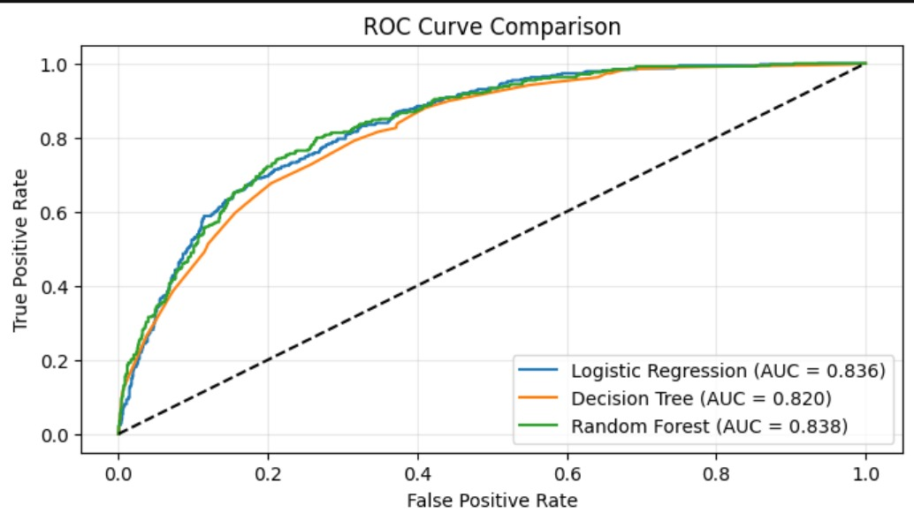
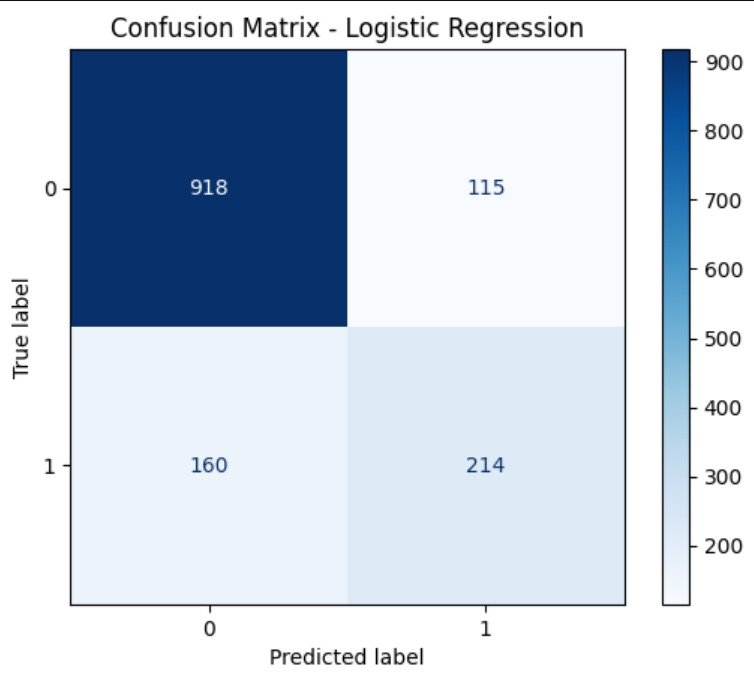

# Customer Churn Prediction using Machine Learning

Overview

Customer churn is one of the biggest challenges faced by subscription-based businesses.

This project develops Machine Learning models to predict whether a customer is likely to leave a telecommunications company based on demographic information, services subscribed to, contract type, billing information, and payment methods.

Three classification algorithms were developed and compared:
	•	Logistic Regression
	•	Decision Tree
	•	Random Forest

The objective was to identify the most effective predictive model while extracting business insights that can support customer retention strategies.

Dataset

Dataset:
Telco Customer Churn Dataset

Target Variable
Churn

Problem Type

Binary Classification

Technologies Used
	•	Python
	•	Pandas
	•	NumPy
	•	Matplotlib
	•	Seaborn
	•	Scikit-Learn
	•	Jupyter Notebook

## Project Highlights

 Data Cleaning

 Exploratory Data Analysis

 Feature Engineering

 Feature Scaling

 Logistic Regression

 Decision Tree

 Random Forest

 ROC Curve

 Confusion Matrix

 Business Recommendations

Project Workflow

Data Cleaning
	•	Removed missing values
	•	Converted TotalCharges to numeric
	•	Checked duplicates
	•	Verified data types

Data Preprocessing
	•	One-Hot Encoding
	•	Feature Scaling
	•	Train/Test Split

Machine Learning Models
	•	Logistic Regression
	•	Decision Tree
	•	Random Forest

Model Evaluation
	•	Accuracy
	•	Precision
	•	Recall
	•	F1 Score
	•	Confusion Matrix
	•	ROC Curve

Model Performance

Model
Accuracy
Precision
Recall
F1 Score
Logistic Regression
80.5%
65.0%
57.2%
60.9%
Decision Tree
77.8%
58.1%
59.6%
58.8%
Random Forest
79.1%
64.4%
47.9%
54.9%

Best Model

Logistic Regression produced the highest overall performance with:
	•	Highest Accuracy
	•	Highest Precision
	•	Highest F1 Score

It is therefore recommended as the preferred model for deployment.

## Key Results

- Dataset: 7,032 customers
- Best Model: Logistic Regression
- Accuracy: 80.5%
- F1 Score: 60.9%
- Three ML models evaluated

Business Insights

The model indicates that customers are more likely to churn when they:
	•	Have Month-to-Month contracts
	•	Use Electronic Check payments
	•	Subscribe to Fiber Optic Internet
	•	Pay higher Monthly Charges

Customers are less likely to churn when they:
	•	Have longer Tenure
	•	Subscribe to One-Year or Two-Year contracts
	•	Use Online Security
	•	Use Tech Support
	•	Have Dependents

These insights can support targeted customer retention strategies and reduce customer loss.

Repository Structure

Customer-Churn-Prediction
│
├── data
├── images
├── notebook
├── README.md
├── requirements.txt
└── LICENSE

## Churn Distribution

## Model Comparison

## Contract Type vs Churn

## ROC Curve

## Logistic Regression Coefficients

Author

Damilola Aderemilekun Adegboye

Data Analyst | Machine Learning Enthusiast

GitHub:
https://github.com/JustDamad
